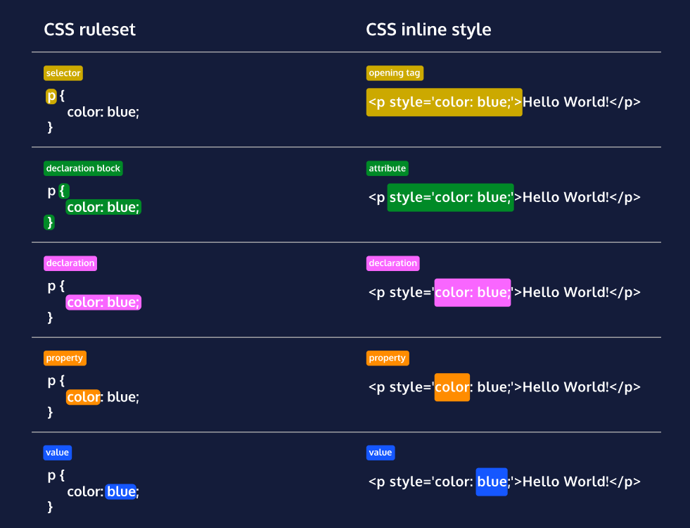

# 1.1 - Lesson - Setup and Syntax
In this lesson, you’ll learn how to set up your CSS file structure and select which HTML elements you wish to style.

## CSS Anatomy
The diagram on the right shows two different methods, or syntaxes, for writing CSS code. The first syntax shows CSS applies as a ruleset, while the second shows it written as an inline style. Two different methods of writing CSS may seem a bit intimidating at first, but it’s not as bad as it looks!

Notice how both syntaxes contain a declaration. Declarations are the core of CSS. They apply a style to the selected element. Here, the ```<p>``` element has been selected in both syntaxes and will be styled to display the text in blue.

Understanding that a declaration is used to style a selected element is key to learning how to style HTML documents with CSS! The terms below explain each of the labels in the diagram below.
<br>

<br>

### Ruleset Terms:

- Selector—The beginning of the ruleset used to target the element that will be styled.
- Declaration Block—The code in-between (and including) the curly braces ({ }) that contains the CSS declaration(s).
- Declaration—The group name for a property and value pair that applies a style to the selected element.
- Property—The first part of the declaration that signifies what visual characteristic of the element is to be modified.
- Value—The second part of the declaration that signifies the value of the property.

### Inline Style Terms:

- Opening Tag—The start of an HTML element. This is the element that will be styled.
- Attribute—The style attribute is used to add CSS inline styles to an HTML element.
- Declaration—The group name for a property and value pair that applies a style to the selected element.
- Property—The first part of the declaration that signifies what visual characteristic of the element is to be modified.
- Value—The second part of the declaration that signifies the value of the property.

## Inline Styles
Although CSS is a different language than HTML, it’s possible to write CSS code directly within HTML code using inline styles.

To style an HTML element, you can add the style attribute directly to the opening tag. After you add the attribute, you can set it equal to the CSS style(s) you’d like applied to that element.
```
<p style='color: red;'>I'm learning to code!</p>
```
It’s important to know that inline styles are a quick way of directly styling an HTML element, but are rarely used when creating websites. But you may encounter circumstances where inline styling is necessary

## Internal Stylesheet
HTML allows you to write CSS code in its own dedicated section with a ```<style>``` element nested inside of the ```<head>``` element. The CSS code inside the ```<style>``` element is often referred to as an internal stylesheet.
To create an internal stylesheet, a ```<style>``` element must be placed inside of the ```<head>``` element.
```
<head>
  <style>
    p {
        color: red;
        font-size: 20px;
    }
  </style>
</head>
```

## External Stylesheet
Developers avoid mixing code by storing HTML and CSS code in separate files (HTML files contain only HTML code, and CSS files contain only CSS code).
You can create an external stylesheet by using the .css file name extension, like so: style.css
With an external stylesheet, you can write all the CSS code needed to style a page without sacrificing the readability and maintainability of your HTML file.

## Linking the CSS File
You can use the ```<link>``` element to link HTML and CSS files together. The ```<link>``` element must be placed within the head of the HTML file. It is a self-closing tag and requires the following attributes:

1. href — like the anchor element, the value of this attribute must be the address, or path, to the CSS file.
2. rel — this attribute describes the relationship between the HTML file and the CSS file. Because you are linking to a stylesheet, the value should be set to stylesheet.
When linking an HTML file and a CSS file together, the ```<link>``` element will look like the following:
```
<link href='https://www.codecademy.com/stylesheets/style.css' rel='stylesheet'>
```
Note that in the example above, the path to the stylesheet is a URL:
```
https://www.codecademy.com/stylesheets/style.css
```
Specifying the path to the stylesheet using a URL is one way of linking a stylesheet.
If the CSS file is stored in the same directory as your HTML file, then you can specify a relative path instead of a URL, like so:
```
<link href='./style.css' rel='stylesheet'>
```
Using a relative path is very common way of linking a stylesheet.

## Review
Great work so far! By understanding how to incorporate CSS code into your HTML file, as well as learning some of the key terms, you’re on your way to creating spectacular websites with HTML and CSS.

Let’s review what you learned so far:

- The basic anatomy of CSS syntax written for both inline styles and stylesheets.
- Some commonly used CSS terms, such as ruleset, selector, and declaration.
- CSS inline styles can be written inside the opening HTML tag using the ```style``` attribute.
- Inline styles can be used to style HTML, but it is not the best practice.
- An internal stylesheet is written using the ```<style>``` element inside the ```<head>``` element of an HTML file.
- Internal stylesheets can be used to style HTML but are also not best practice.
- An external stylesheet separates CSS code from HTML, by using the “.css”.file extension.
- External stylesheets are the best approach when it comes to using HTML and CSS.
- External stylesheets are linked to HTML using the ```<link>``` element.