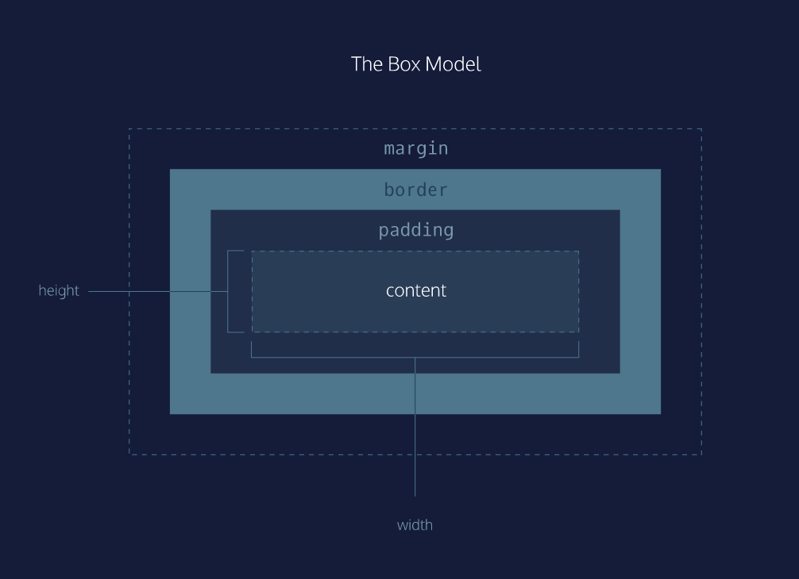

# 3.1 - Lesson - The Box Model
In this lesson, you’ll learn how to set up your CSS positioning Rules.

## The Box Model
The box model comprises the set of properties that define parts of an element that take up space on a web page. The model includes the content area’s size (width and height) and the element’s padding, border, and margin. The properties include:

1. ```width``` and ```height```: The width and height of the content area.
2. ```padding```: The amount of space between the content area and the border.
3. ```border```: The thickness and style of the border surrounding the content area and padding.
4. ```margin```: The amount of space between the border and the outside edge of the element.

<br>

<br>

## Height and Width
An element’s content has two dimensions: a height and a width. By default, the dimensions of an HTML box are set to hold the raw contents of the box.

The CSS height and width properties can be used to modify these default dimensions.
```
p {
  height: 80px;
  width: 240px;
}
```

## Borders
A border is a line that surrounds an element, like a frame around a painting. Borders can be set with a specific ```width```, ```style```, and ```color```:

- ```width```—The thickness of the border. A border’s thickness can be set in pixels or with one of the following keywords: ```thin```, ```medium```, or ```thick```.
- ```style```—The design of the border. Web browsers can render any of 10 different styles. Some of these styles include: ```none```, ```dotted```, and ```solid```.
- ```color```—The color of the border. Web browsers can render colors using a few different formats, including 140 built-in color keywords.
```
p {
  border: 3px solid coral;
}
```
The default border is medium none color, where color is the current color of the element.

## Border Radius
Ever since we revealed the borders of boxes, you may have noticed that the borders highlight the true shape of an element’s box: square. Thanks to CSS, a border doesn’t have to be square.

You can modify the corners of an element’s border box with the border-radius property.
```
div.container {
  border: 3px solid blue;
  border-radius: 5px;
}
```

## Padding
The space between the contents of a box and the borders of a box is known as padding. Padding is like the space between a picture and the frame surrounding it. In CSS, you can modify this space with the ```padding``` property.
```
p.content-header {
  border: 3px solid coral;
  padding: 10px;
}
```
The ```padding``` property is often used to expand the background color and make the content look less cramped (thinner).

## Margin
So far you’ve learned about the following components of the box model: content, borders, and padding. The fourth and final component of the box model is margin.

Margin refers to the space directly outside of the box. The margin property is used to specify the size of this space.

p {
  border: 1px solid aquamarine;
  margin: 20px;
}

## Shorthand
Another implementation of the padding/margin property lets you specify exactly how much padding there should be on each side of the content in a single declaration. A declaration that uses multiple properties as values is known as a shorthand property.

Padding shorthand lets you specify all of the padding properties as values on a single line:
- padding-top
- padding-right
- padding-bottom
- padding-left

You can specify these properties in a few different ways:

### 4 Values:
```
p.content-header {
  padding: 6px 11px 4px 9px;
}
```
In order, it specifies the padding-top value (6px), the padding-right value (11px), the padding-bottom value (4px), and the padding-left value (9px) of the content.

### 3 Values:
```
p.content-header {
  padding: 5px 10px 20px;
}
```
The first value sets the padding-top value (5px), the second value sets the padding-left and padding-right values (10px), and the third value sets the padding-bottom value (20px).

### 2 Values:
```
p.content-header {
  padding: 5px 10px;
}
```
The first value sets the padding-top and padding-bottom values (5px), and the second value sets the padding-left and padding-right values (10px).

## Auto
The margin property also lets you center content. However, you must follow a few syntax requirements. Take a look at the following example:
```
div.headline {
  width: 400px;
  margin: 0 auto;
}
```
In the example above, margin: 0 auto; will center the divs in their containing elements. The 0 sets the top and bottom margins to 0 pixels. The auto value instructs the browser to adjust the left and right margins until the element is centered within its containing element.

In order to center an element, a width must be set for that element. Otherwise, the width of the div will be automatically set to the full width of its containing element, like the ```<body>```, for example. It’s not possible to center an element that takes up the full width of the page, since the width of the page can change due to display and/or browser window size.

In the example above, the width of the div is set to 400 pixels, which is less than the width of most screens. This will cause the div to center within a containing element that is greater than 400 pixels wide.

## Margin Collapse (Vertical)
As you have seen, padding is space added inside an element’s border, while margin is space added outside an element’s border. One additional difference is that top and bottom margins, also called vertical margins, collapse, while top and bottom padding does not.

Horizontal margins (left and right), like padding, are always displayed and added together. For example, if two divs with ids #div-one and #div-two, are next to each other, they will be as far apart as the sum of their adjacent margins.
<br>

<br>

## Minimum and Maximum Height and Width
Because a web page can be viewed through displays of differing screen size, the content on the web page can suffer from those changes in size. To avoid this problem, CSS offers two properties that can limit how narrow or how wide an element’s box can be sized to:

- min-width—this property ensures a minimum width of an element’s box.
- max-width—this property ensures a maximum width of an element’s box.
```
p {
  min-width: 300px;
  max-width: 600px;
}
```
In the example above, the width of all paragraphs will not shrink below 300 pixels, nor will the width exceed 600 pixels.

Content, like text, can become difficult to read when a browser window is narrowed or expanded. These two properties ensure that content is legible by limiting the minimum and maximum widths of an element.

## Overflow
All of the components of the box model comprise an element’s size. For example, an image that has the following dimensions is 364 pixels wide and 244 pixels tall.

- 300 pixels wide
- 200 pixels tall
- 10 pixels padding on the left and right
- 10 pixels padding on the top and bottom
- 2 pixels border on the left and right
- 2 pixels border on the top and bottom
- 20 pixels margin on the left and right
- 10 pixels margin on the top and bottom
The total dimensions (364px by 244px) are calculated by adding all of the vertical dimensions together and all of the horizontal dimensions together. Sometimes, these components result in an element that is larger than the parent’s containing area.

How can we ensure that we can view all of an element that is larger than its parent’s containing area?

The overflow property controls what happens to content that spills, or overflows, outside its box. The most commonly used values are:

- ```hidden```—when set to this value, any content that overflows will be hidden from view.
- ```scroll```—when set to this value, a scrollbar will be added to the element’s box so that the rest of the content can be viewed by scrolling.
- ```visible```—when set to this value, the overflow content will be displayed outside of the containing element. Note, this is the default value.
```
p {
  overflow: scroll; 
}
```

## Resetting Defaults
All major web browsers have a default stylesheet they use in the absence of an external stylesheet. These default stylesheets are known as user agent stylesheets. In this case, the term user agent is a technical term for the browser.

User agent stylesheets often have default CSS rules that set default values for padding and margin. This affects how the browser displays HTML elements, which can make it difficult for a developer to design or style a web page.

Many developers choose to reset these default values so that they can truly work with a clean slate.
```
* {
  margin: 0;
  padding: 0;
}
```
The code in the example above resets the default margin and padding values of all HTML elements. It is often the first CSS rule in an external stylesheet.

Note that both properties are both set to 0. When these properties are set to 0, they do not require a unit of measurement.

## Visibility
Elements can be hidden from view with the visibility property.

The visibility property can be set to one of the following values:

hidden — hides an element.
visible — displays an element.
collapse — collapses an element.

Note: What’s the difference between display: none and visibility: hidden? An element with display: none will be completely removed from the web page. An element with visibility: hidden, however, will not be visible on the web page, but the space reserved for it will.

## Review
In this lesson, we covered the four properties of the box model: height and width, padding, borders, and margins. Understanding the box model is an important step towards learning more advanced HTML and CSS topics. Let’s take a minute to review what you learned:

- The box model comprises a set of properties used to create space around and between HTML elements.
- The height and width of a content area can be set in pixels or percentages.
- Borders surround the content area and padding of an element. The color, style, and thickness of a border can be set with CSS properties.
- Padding is the space between the content area and the border. It can be set in pixels or percent.
- Margin is the amount of spacing outside of an element’s border.
- Horizontal margins add, so the total space between the borders of adjacent elements is equal to the sum of the right margin of one element and the left margin of the adjacent element.
- Vertical margins collapse, so the space between vertically adjacent elements is equal to the larger margin.
- ```margin: 0 auto``` horizontally centers an element inside of its parent content area, if it has a width.
- The ```overflow``` property can be set to ```display```, ```hide```, or ```scroll```, and dictates how HTML will render content that overflows its parent’s content area.
- The ```visibility``` property can hide or show elements.